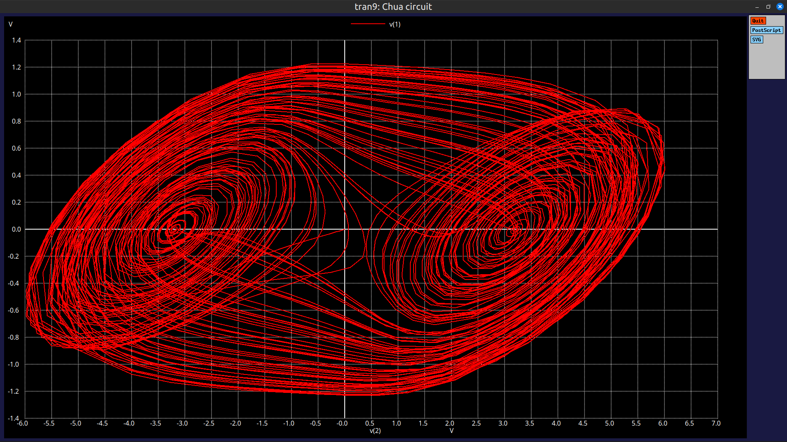
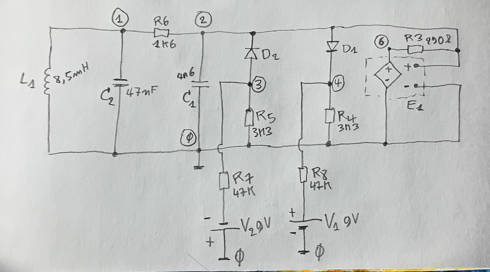
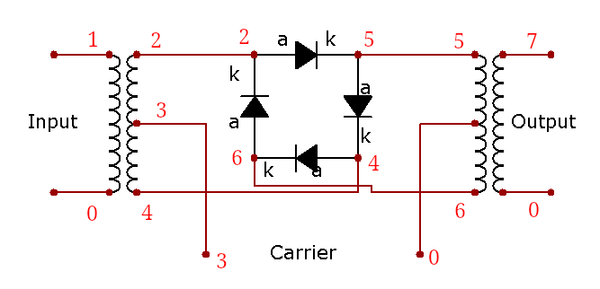
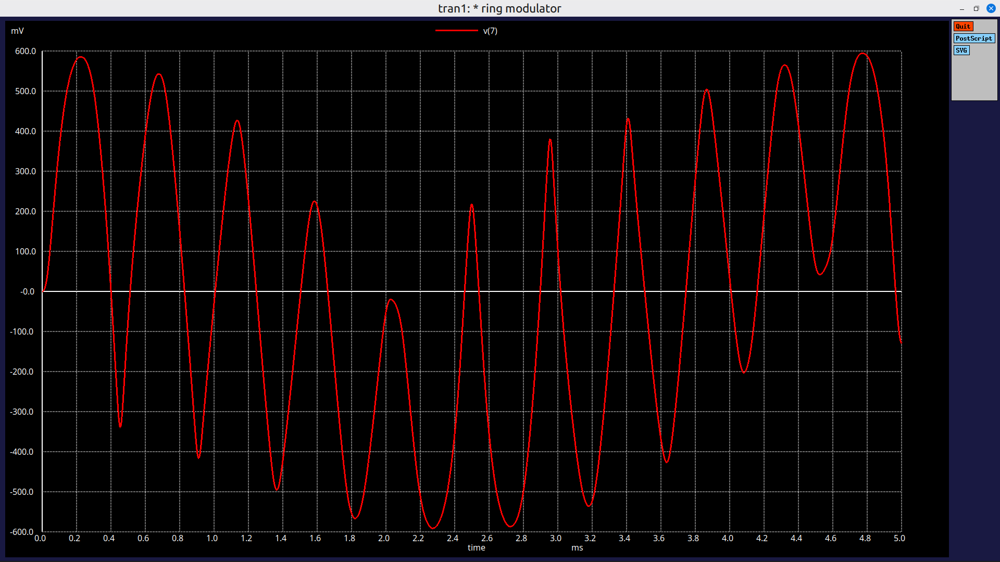
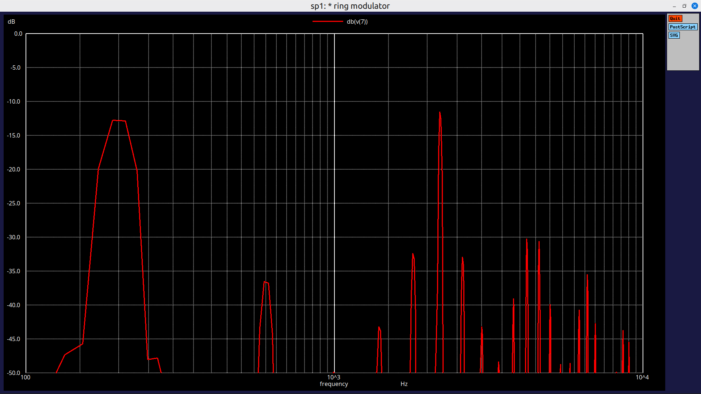
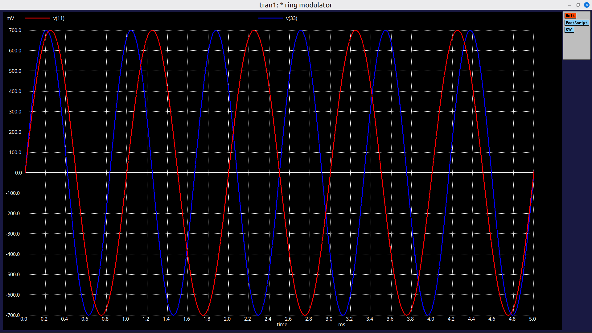

# ngspice_analog_circuit_simulation
Files for use with the [ngspice](https://ngspice.sourceforge.io/) circuit simulation software

## [Chua's circuit](chua_circuit_6.sp)

This circuit desciption runs a version of Chua' circuit which shows chaotic behavior.

Circuit description file: [chua_circuit_6.sp](chua_circuit_6.sp)

This plot generated by ngspice shows two voltages in the circuit in a x-y plot.

The circuit description file was made based on this hand drawn schematic:

The amplifier in the circuit was modelled using a Voltage Dependent Voltage Source (E1), the output voltage is limited as in real world amplifiers using the table option.

Te diodes and voltage sources introduce non-linearity which is a essential part of the circuit.

## Ring Modulator

This is a classic ring modulator with 4 diodes. The circuit multiplies two signals creating new sum and difference frequency components at it's output.

Schematic found on wikimedia: [https://commons.wikimedia.org/wiki/File:Ring_Modulator.PNG](https://commons.wikimedia.org/wiki/File:Ring_Modulator.PNG)
Modified by adding node numbers.

Circuit desciption file: [ring_mod.sp](ring_mod.sp)

In this example inputs to the circuit are signals at 1kHz and 1.2kHz, the output includes components at 2.2kHz (sum) and 200Hz (difference).

Output signal:

Frequency spectrum of output signal:

Input signals:

